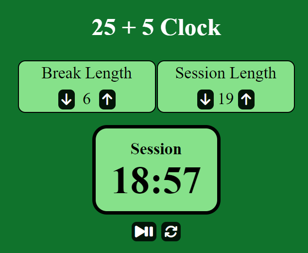
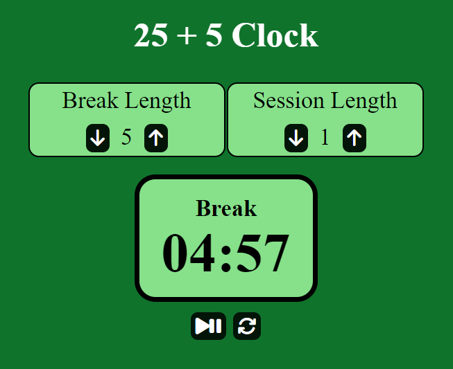

# 25 + 5 Clock

It is a 25+5 Clock. You do whatever task you have in mind during the "session" length, then take "breaks" for the selected amount of time.

## Contents

- [Features](#features)
- [Installation](#installation)
- [Functionality and Screenshots](#functionality-and-screenshots)
- [Credits](#credits)

## Features

- Select how long you want your sessions.
- Select how long you want your breaks.
- When the timer hits 0, a beep will play to inform the user.
- The timer can be paused and played at any time.
- The timer can be reset at any moment aswell.

## Installation

In the project directory, you can run:

### `npm start`

Runs the app in the development mode.\
Open [http://localhost:3000](http://localhost:3000) to view it in your browser.

The page will reload when you make changes.\
You may also see any lint errors in the console.

### `npm test`

Launches the test runner in the interactive watch mode.\
See the section about [running tests](https://facebook.github.io/create-react-app/docs/running-tests) for more information.

### `npm run build`

Builds the app for production to the `build` folder.\
It correctly bundles React in production mode and optimizes the build for the best performance.

The build is minified and the filenames include the hashes.\
Your app is ready to be deployed!

See the section about [deployment](https://facebook.github.io/create-react-app/docs/deployment) for more information.

### `npm run eject`

**Note: this is a one-way operation. Once you `eject`, you can't go back!**

If you aren't satisfied with the build tool and configuration choices, you can `eject` at any time. This command will remove the single build dependency from your project.

Instead, it will copy all the configuration files and the transitive dependencies (webpack, Babel, ESLint, etc) right into your project so you have full control over them. All of the commands except `eject` will still work, but they will point to the copied scripts so you can tweak them. At this point you're on your own.

You don't have to ever use `eject`. The curated feature set is suitable for small and middle deployments, and you shouldn't feel obligated to use this feature. However we understand that this tool wouldn't be useful if you couldn't customize it when you are ready for it.

## Functionality and Screenshots

*25 + 5 Clock - Session Timer*

This is what the page looks like while the session timer is running.
- The starting length of session is determined by "Session Length" which can be incremented or decremented by 1 minute at a time using the two nearby buttons.
- Clicking the play/pause button will start the timer.
- Upon hitting 00:00, the timer will switch to the break timer and a beeping sound will play.

*25 + 5 Clock - Break Timer*

The break timer playing once session timer hits 0.
- Text above the timer switches to "Break", and begins counting down from the value set at "Break Length".
- The length of break length can be changed, however note that they can not be altered while the timer is playing.
- Changing the length of a timer while the clock is paused will also reset it.
- Once the break timer hits 0, the timer text will switch to "Session" and the timer will be set to "Session Length" and begin counting down again, forming an endless loop until the user intervenes.

## Credits

### Code

- The accurateInterval function is from [this codepen by Peter Weinberg](https://codepen.io/no_stack_dub_sack/pen/VKJGKd), which is a more accurate timer than setInterval().
- The beeping sound played when the timer hits 0 is also from Peter Weinberg.

### Tools

- JavaScript
- React
- Font Awesome
- SCSS
- HTML

[Back to Top](#contents)
